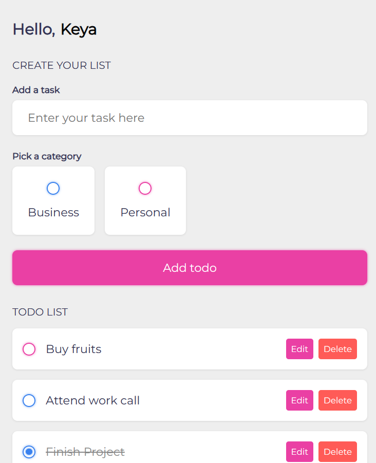

# To-Do List Project

Welcome to the To-Do List project repository! This project allows you to manage your tasks in different categories, such as business and personal, with color-coded organization.
You can view the website [here](https://keya161.github.io/Todo-list/).

## Description

This repository contains a web-based To-Do List application built using HTML, CSS, and JavaScript. The application allows you to:

- Create tasks and assign them to categories: Business, Personal, or Other (if the task doesn't fit into the predefined categories).
- Color-code tasks based on their categories.
- Mark tasks as completed, which will strike them through to indicate their status.
- Edit tasks to update their content or category.
- Delete tasks when they are no longer needed.

## Preview

## Usage

1. Open the [To-Do List application](https://keya161.github.io/Todo-list/) to start managing your tasks.
2. Enter the task description and choose a category for the task (Business, Personal, or Other).
3. Click the "Add Task" button to add the task to the list.
4. To mark a task as completed, click on the task's checkbox.
5. To edit a task, click the edit icon next to the task and make your changes.
6. To delete a task, click the delete icon next to the task.

## Technologies Used

- HTML
- CSS
- JavaScript

## Acknowledgments

This project was created as a practice exercise to enhance front-end development skills. Original design and concept inspired by various To-Do List applications.

Feel free to explore the code and provide feedback or suggestions!

